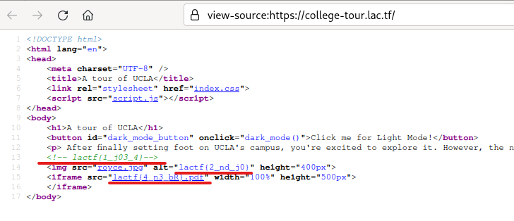
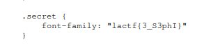
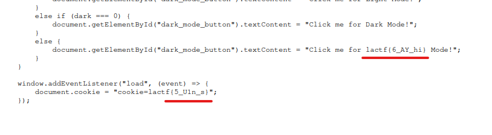
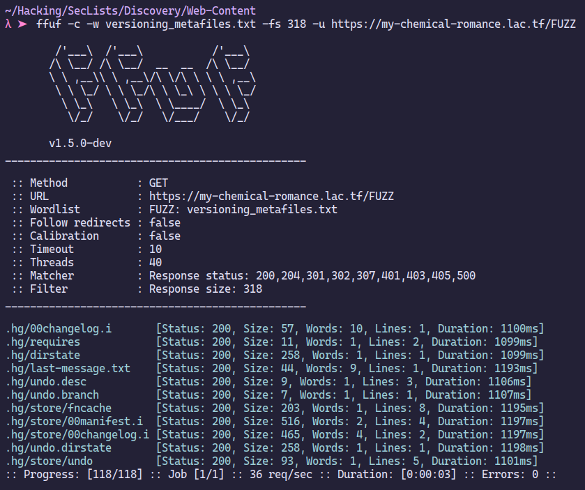
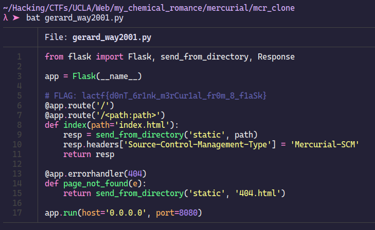
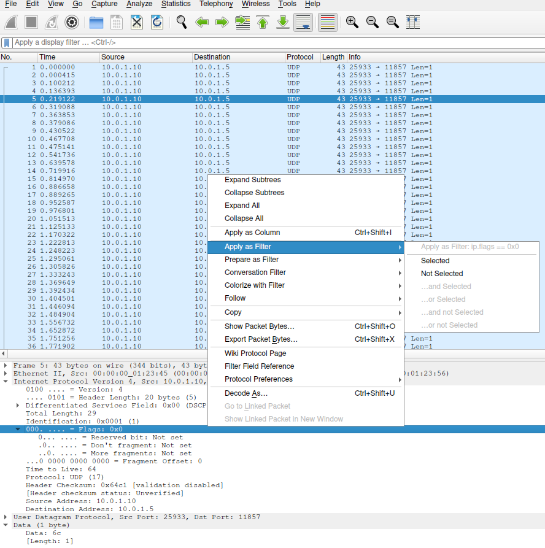

# Table of Contents
[web/college-tour](#college-tour)

[web/my-chemical-romance](#my-chemical-romance)

[misc/hike-to-where](#hike-to-where)

[misc/CATS!](#cats)

[misc/EBE](#ebe)


# Web

## college-tour
- Description: Welcome to UCLA! To explore the #1 public college, we have prepared a scavenger hunt for you to walk all around the beautiful campus.
- Links: https://college-tour.lac.tf


Pretty straight forward challenge. We are asked to find 6 flags and combine them.

Checking out the source of the webpage, we find the first 3 flags.



Next flag is in the `index.css` file.



Final two flags are in the `script.js`.



Combining them, we have `lactf{j03_4nd_j0S3phIn3_bRU1n_sAY_hi}`

---

## my-chemical-romance
- Description: When I was... a young boy... I made a "My Chemical Romance" fanpage!
- Links: https://my-chemical-romance.lac.tf/

The website doesn't have anything interactible. So, the only option is to fuzz.

Using SecLists, we first do a File and Directory fuzz. This yields nothing and we only find `index.html` and `index.css`.

Doing DNS fuzz also doesn't result in anything.

Finally, we do version controll file/directory fuzzing.



We get some interesting stuff. The website uses `mercurial-scm` as its version control software.

Save the urls in a text file and use the following command to download the files:

```bash
# I created a separate dir
# urls.txt file is 1 directory up
while read i; do wget https://my-chemical-romance.lac.tf/$i; done < ../urls.txt
```

Researching how to interact with mercurial, we find that there is a command line tool called `hg`.

Running `hg status`, `hg logs`, etc. and looking at he errors, we get the hints that we need to create a `.hg` directory and copy the downloaded files there. Inside that, we need to create `store` directory and `mv` `requires` inside store.

Unfortunately, after doing all this, we cannot access the previous files or commit logs.

Researching a bit more, we find out that we can simply clone the repository using the url.

```bash
hg clone https://my-chemical-romance.lac.tf/ ./mcr_clone
```


There is a file called `gerard_way2001.py`, but it does not contain the flag.

Running `hg log`, we see the previous commits:

```bash
$ hg log
changeset:   1:3ecb3a79e255
tag:         tip
user:        bliutech <bensonhliu@gmail.com>
date:        Fri Feb 10 06:50:48 2023 -0800
summary:     Decided to keep my favorite song a secret :D

changeset:   0:2445227b04cd
user:        bliutech <bensonhliu@gmail.com>
date:        Fri Feb 10 06:49:48 2023 -0800
summary:     I love 'My Chemical Romance'
```

We can get the old commit using:

```bash
$ hg checkout 2445227b04cd
2 files updated, 0 files merged, 0 files removed, 0 files unresolved
```

Now, if we `cat` the `gerard_way2001.py`, we get the flag.



---

# Misc

## hike-to-where
- Description: Where was this photo taken? I think it used to be in the original photo, but someone cropped it out!
- Files: picture.jpg
- *Note: We got the 3rd ever solve on this!*

This was the given picture:


We googled `UCLA professor hiking`. And the first results were promissing.


Navigating to the instagram page: https://www.instagram.com/peaksandprofessors.ucla/?hl=en, we find the following post


The location is `Skull Rock`.

---

## CATS!
- Description: CATS OMG I CAN'T BELIEVE HOW MANY CATS ARE IN THIS IMAGE I NEED TO VISIT CAN YOU FIGURE OUT THE NAME OF THIS CAT HEAVEN? Answer is the domain of the website for this location. For example, if the answer was ucla, the flag would be lactf{ucla.edu}.

- Files: CATS.jpeg

We are asked to find the website. Using `exiftool` on the image, we get:

```bash
$ exiftool CATS.jpeg
# snip
Sub-location                    : Lanai Cat Sanctuary
Province-State                  : HI
Country-Primary Location Code   : US
Country-Primary Location Name   : United States
Application Record Version      : 4
XMP Toolkit                     : Image::ExifTool 12.42
Country Code                    : US
Location                        : Lanai Cat Sanctuary
Location Created City           : Lanai City
Location Created Country Code   : US
Location Created Country Name   : United States
Location Created Province State : HI
Location Created Sublocation    : Lanai Cat Sanctuary
City                            : Lanai City
# snip
```

And, this is the flag: https://lanaicatsanctuary.org/

---

## EBE
- Description: I was trying to send a flag to my friend over UDP, one character at a time, but it got corrupted! I think someone else was messing around with me and sent extra bytes, though it seems like they actually abided by RFC 3514 for once. Can you get the flag?
- Files: EBE.pcap

We are given a `pcap` file and an RFC. The tl;dr of RFC is packages with flag 0 are acceptable and with flag 1 not acceptable.

So, in the challenge we have to filter the packages with flag 0 and extract the characters.

In `wireshark`, we first find a package with `IPv4` flags set to `0x0`. Then, right click on the `flags` field, Apply as Filter -> Selected:



Alternatively, type `ip.flags == 0x0` in the top filter bar.

Next, go to `File -> Export Packet Dissections -> As JSON`.

We want the `hex` value in the `data.data` field of the JSON file.
To do this, we run:

```bash
grep data.data ebe.json | awk '{print $3}' > ebe.txt
```

Now, we have the values, but we need to remove the `"`, `,` and new lines.

I used `vim` regex for this. Open the `ebe.txt` using vim and type the following:

```text
# To remove "s
:%s/"//g
# To remove , and new-line
:%s/,\n//g
# Save and quit
:x
```

Now, you will have the following:

```bash
$ cat ebe.txt
6c616374667b3356314c5f3831375f337866316c3752343731304e5f345f3748335f57314e5f353144343363383030303033346430637d
```

This is `hex`. To decode it, run:

```bash
$ xxd -r -p ebe.txt
lactf{3V1L_817_3xf1l7R4710N_4_7H3_W1N_51D43c8000034d0c}
```

---