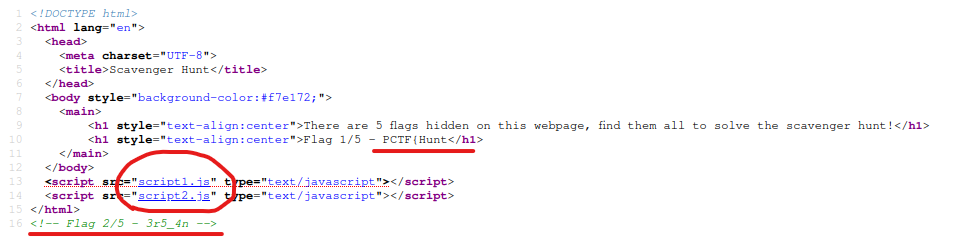
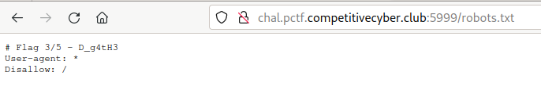
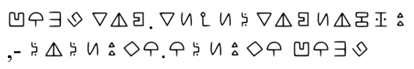
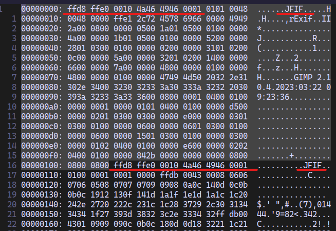
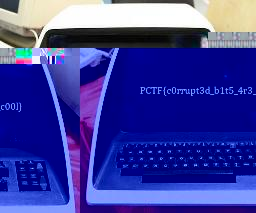
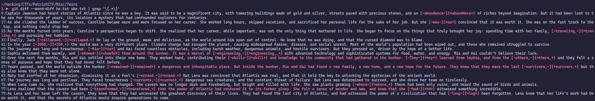
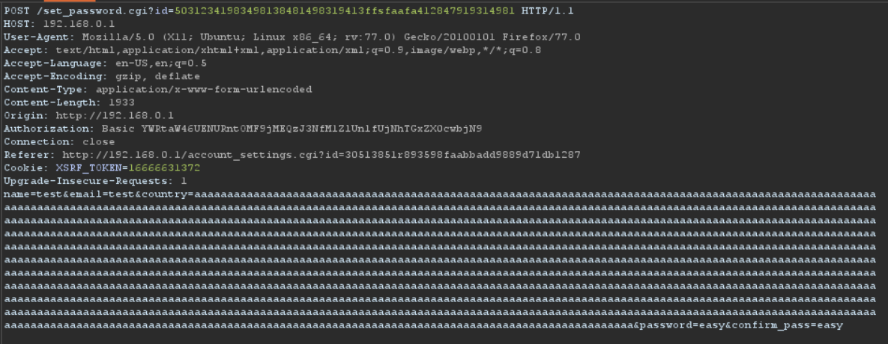

This CTF was very fun and had a lot of high quality challenges. It was a shame that I only had 1 day to tackle these challenges. Here are my writeups of the challenges that I solved.
# Table of Contents
- [Web](#web)
	- [Scavenger Hunt](#scavenger%20hunt)
- [Crypto](#crypto)
	- [Multi-numeral](#multi-numeral)
	- [My phone!](#my%20phone!)
- [Forensics](#forensics)
	- [Unsupported format](#unsupported%20format)
- [MISC](#misc)
	- [Twins](#twins)
	- [WPA](#wpa)
- [OSINT](#osint)
	- [Bad Documentation](#bad%20documentation)
- [Reversing](#reversing)
	- [Python XOR](#python%20xor)

## Web
### Scavenger Hunt
*Task: Can you find all the hidden pieces of the flag?*
*Given: http://chal.pctf.competitivecyber.club:5999/*

All 5 flags are hidden in the webpage. Navigating to webpage and looking at the source, we get two flags.



The other two flags are in the `script1.js` and `script2.js`. `script1.js` writes the part of the flag to console, so alternatively you can look at your developer console. `script2.js`, sets the cookie. So, alternatively you can check you cookie and get the flag.

Last flag is hidden better and requires you to know some web concepts. It is located in `robots.txt` file.



*Flag: `PCTF{Hunt3r5_4nD_g4tH3R5_e49e4a541}`*

---
## Crypto
### Multi-numeral
*Task: Much numbers, many wows.*
*Given: Challenge.txt*

We are given a file that it's content are:

```bash
cat Challenge.txt
0011010100110011001000000011010100110011001000000011001100110010001000000011010100110010001000000011010100110011001000000011001100110010001000000011010100110010001000000011011000111001001000000011001100110010001000000011010100110011001000000011010100110011001000000011001100110010001000000011010100110011001000000011010100110000001000000011001100110010001000000011010100110100001000000011011000111001001000000011001100110010001000000011010100110101001000000011010100110010001000000011001100110010001000000011010100110001001000000011010100110001001000000011001100110010001000000011010100110010001000000011011000111000001000000011001100110010001000000011010100110010001000000011010100110110001000000011001100110010001000000011010100110100001000000011010100110010001000000011001100110010001000000011010100110100001000000011010100110100001000000011001100110010001000000011010100110100001000000011010100110001001000000011001100110010001000000011010100110101001000000011011000110101001000000011001100110010001000000011010100110010001000000011010100110000001000000011001100110010001000000011010100110100001000000011010100110100001000000011001100110010001000000011010100110100001000000011010100110000001000000011001100110010001000000011010100110011001000000011010100110010001000000011001100110010001000000011010100110011001000000011010100110000001000000011001100110010001000000011010100110101001000000011010100110011001000000011001100110010001000000011010100110100001000000011010100110011001000000011001100110010001000000011010100110011001000000011010100110100001000000011001100110010001000000011010100110001001000000011010100110111001000000011001100110010001000000011010100110101001000000011010100110011001000000011001100110010001000000011010100110100001000000011010100110010001000000011001100110010001000000011010100110011001000000011010100110101001000000011001100110010001000000011010100110001001000000011010000111001001000000011001100110010001000000011010100110100001000000011010100110111001000000011001100110010001000000011010100110011001000000011011000110101001000000011001100110010001000000011010100110011001000000011010100110110001000000011001100110010001000000011010100110010001000000011010100110111001000000011001100110010001000000011010100110001001000000011010000111001001000000011001100110010001000000011010100110100001000000011010100110100001000000011001100110010001000000011010100110011001000000011010000111001001000000011001100110010001000000011010100110001001000000011011000111000001000000011001100110010001000000011010100110001001000000011011000111000
```

This is clearly binary, so we have to transfer it to something we can understand, such as hex or string. We can do this, using CyberChef. CyberChef does converts the `binary` to its `string` representation.


Looks like we got integer representation of characters now. We can again look for the correct recipe/function to do the conversion. But, at this point, I decided to use the `Magic` recipe of CyberChef.


And we got the flag. The steps necessary were `From_Decimal -> From_Hex -> From_Base64`

*Flag: PCTF{w0w_s0_m4ny_number5}*

### My phone!
*Task: Some weird triangle man stole my phone, he taunted me by sending me his location but it seems to be encrypted with some odd cipher I've never seen before, could you please help me get my phone back?*
*Given: cipher.png*

We are given a `png` file which looks like this:



At first, we tried to do the most used characters in the English language analysis on this, however, that seemed too much work for an easy labeled challenge.
There were no metadata attached to the image, so we decided to do google reverse image search.

After searching for a bit, we found out that this is from `Gravity Falls` and the "weird triangle man" in the description is `Bill Cipher`. So, we googled "bill cipher decryptor" and found out this: https://www.dcode.fr/gravity-falls-bill-cipher


We have: `FOURSIX. SEVENSIXEIGHT, -NINETWO. ONETWOFOUR` and in numbers: `46.768, -92.124`
These look like coordinates and if we use Google Maps, we find the city that we are looking for:


*Flag: PCTF{duluth}*

---
## Forensics
### Unsupported format
*Task: My friend sent me a picture of his brand new computer, but something strange happened to it and now it says "Unsupported Format" when I try to open it. Can you try to help me recover the image?*
*Given Flag.jpg*

We are given a `jpg` file. When we try to open it, we get the following message:

```bash
feh Flag.jpg
feh WARNING: Flag.jpg - No Imlib2 loader for that file format
feh: No loadable images specified.
See 'feh --help' or 'man feh' for detailed usage information
```

Maybe the magic bytes are corrupted and it is an easy fix. Next we run `file` on the `jpg`:

```bash
file Flag.jpg
Flag.jpg: JPEG image data, JFIF standard 1.01, resolution (DPI), density 72x72, segment length 16, Exif Standard: [TIFF image data, little-endian, direntries=5, xresolution=74, yresolution=82, resolutionunit=2, software=GIMP 2.10.4, datetime=2023:03:22 09:23:36]
```

Looks like the magic bytes are as the should be. We have to look at the `hex` representation of the file. We can use `xxd Flag.jpg | vim`:



We notice something interested. Looks like two `jpg` files are stacked on top of each other in the same file. Next, we try to separate them to two different files.
For this task, I used `GHex` hex editor.
To select correct parts of the file, we need to know that (some*) `jpg` files start with `FF D8 FF E0 00 10 4A 46 49 46 00 01` and end with `FF D9`. This is not the face for the first header however. So, you have to cut until the start of the next `jpg` magic bytes.

As a result, we get two files. The first one is corrupt. However, the second one is not and we get the flag.



*Flag: PCTF{c0rrupt3d_b1t5_4r3_c00l}*

---
## MISC
### Twins
*Task: How did the twin feel after meeting his long-lost brother? He was beside himself.*
*Given: he.txt, she.txt*

We are given two very long text files. Seems like a part of a story book. Both files seem *almost* identical. The check this fact, we can either use `diff` or `git diff`. We want to see the word differences, so I decided to use `git diff`:



We see that some words are different. Some are missing a character or uses a different character. We copy the changed words and write down the missing or changed characters and we get the flag.

*Flag: PCTF{4wes0M3_sTories_man}*

### WPA
*Task: I really need to get on my friends WiFi, but he won't give me the password. I think he think's I'll mess around on his network. I started a packet capture and left it running a while, I think someone connected to the network before I stopped the capture. Can you help me?*
*Given: savedcap.cap*

We are given a `pcap` file. So, the first thing to do is to look at it in Wireshark. Unfortunately, the packets are encrypted with the WPA password and we can't see any data related packets. The flag format is also asking for the password. We know that this is WPA and we need the password, so we need to crack it.

To do this, we can use `aircrack-ng` and a wordlist like `rockyou.txt`.

```bash
aircrack-ng -w ~/Hacking/SecLists/Passwords/Leaked-Databases/rockyou.txt savedcap.cap

Reading packets, please wait...
Opening savedcap.cap
Read 888 packets.

   #  BSSID              ESSID                     Encryption

   1  52:E2:4D:0A:A6:36  Pctf wifi challenge       WPA (1 handshake)

Choosing first network as target.

Reading packets, please wait...
Opening savedcap.cap
Read 888 packets.

1 potential targets

                               Aircrack-ng 1.7

      [00:00:01] 2003/10303727 keys tested (2400.77 k/s)

      Time left: 1 hour, 11 minutes, 31 seconds                  0.02%

                           KEY FOUND! [ qazwsxedc ]


      Master Key     : D9 2A 24 C3 1D DB EF C0 58 AF 10 9F F2 F5 DE E9
                       0C B6 EC F9 59 4E 39 7C 6E 50 E8 B5 3D 61 7E C4

      Transient Key  : 25 80 02 DF B8 39 C7 F1 46 08 E5 88 24 2F 50 8A
                       5E D9 65 17 AD C6 AC DC 83 00 D6 D3 39 37 77 DF
                       14 83 00 FF 3D E1 6D 13 CA D3 B4 40 C9 90 3C 22
                       51 9A 1F ED E1 C5 22 ED 75 3C 1B 3F 4D C6 32 BE

      EAPOL HMAC     : 2F F5 73 C8 A5 66 B0 60 7D EF 8F 51 B0 64 F6 65
```

We get the password and the flag.

*Flag: PCTF{qazwsxedc}*

---
## OSINT
### Bad Documentation
*Task: I heard that this security researcher accidentally leaked his password in his documentation, but he deleted all the files in his repository so now we don't have access to it anymore! I'm pretty sure it's hopeless, but if you think you can find it here's the link to the repo: https://github.com/Th3Burn1nat0r/vuln.*

We are given a GitHub repository and we have to find the leaked password in the documentation.

The repo has 8 commits, so we check them out one by one. Most of the commits are not interesting, but this one has a picture associated with it: https://github.com/Th3Burn1nat0r/vuln/commit/52552b52ac8ad993d150ff83a8e12bfeee6e74e6



Looking at the picture, we see the `Authorization` tag using `Basic`. `Basic` does `base64` encoding on the `id:password` pair. So, if we decode it, we should see the plain password. The font used is bad and `1`s look like `l`s. Same with `0` and `O`. So, it takes a bit of trial and error to get the flag. To decode, you can either use `base64 -d` or CyberChef.

*Flag: PCTF{N0_c0D3's_2VeRy_R3aLlY_G0n3}*

---
## Reversing
### Python XOR
*Task*: The flag has been encrypted, yet again. Find a way to iterate through the alphabet variable to decrypt the flag.
*Given: XOR.py*

We are given the following code:

```python
from string import punctuation

alphabet = list(punctuation)
data = "bHEC_T]PLKJ{MW{AdW]Y"
def main():
#   For loop goes here
    key = ('')
    decrypted = ''.join([chr(ord(x) ^ ord(key)) for x in data])
    print(decrypted)
main()
```

We are also given a hint that we have to use a for loop.
This is a simple and straight forward `XOR` decryption. Think it as a one-time-pad, but the same key is used for each character. If we for loop over the alphabet, we will get the flag:

```python
from string import punctuation

alphabet = list(punctuation)
data = "bHEC_T]PLKJ{MW{AdW]Y"
def main():
#   For loop goes here
    for i in alphabet:
        print(i)
        key = i
        decrypted = ''.join([chr(ord(x) ^ ord(key)) for x in data])
        print(decrypted)
main()
```

However, we can get it in a more interesting way.

We know that the first character of the encrypted data is `b` and we also know that the decrypted version must look like `F` (flag format Flag{}).

So, we must find a value, such that `F = b ^ x` where `x` is another character.
Binary representation of `F` is `01000110` and `b` is `01100010`. So, we have

`01000110 = 01100010 ^ x`. If `x` is `00100100`, which is `$`.

So, if we put `$`, as the `key` variable, we get:

```python
from string import punctuation

alphabet = list(punctuation)
data = "bHEC_T]PLKJ{MW{AdW]Y"
def main():
    key = ('$')
    decrypted = ''.join([chr(ord(x) ^ ord(key)) for x in data])
    print(decrypted)
main()
```

and run:

```bash
python3 XOR.py
Flag{python_is_e@sy}
```

*Flag: Flag{python_is_e@sy}*
